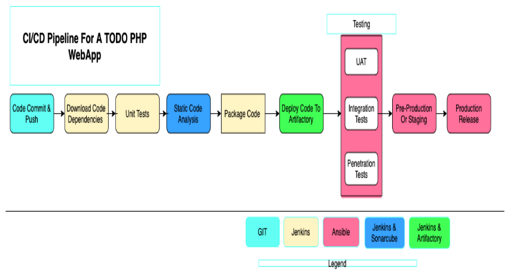
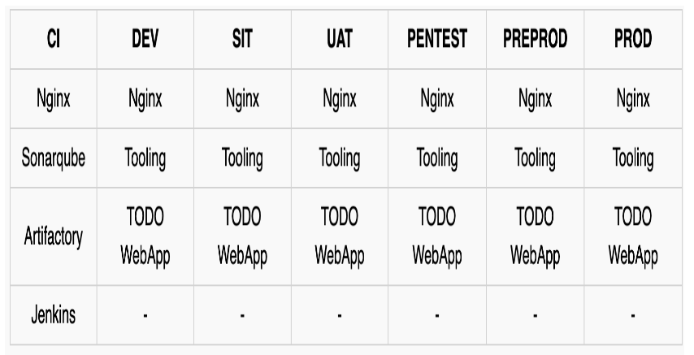
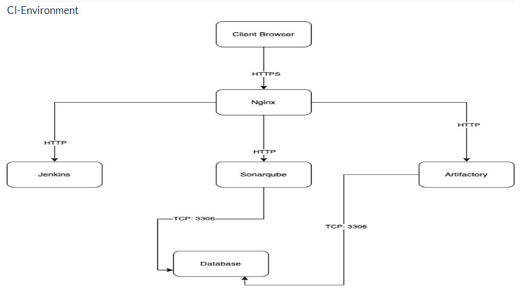
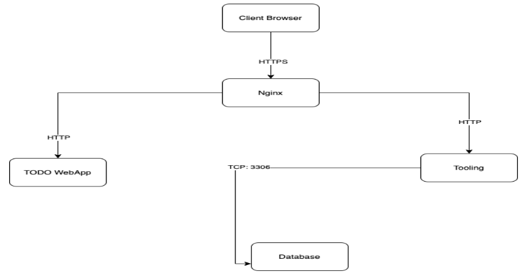
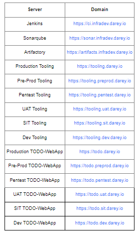

# Simulating a typical CI/CD Pipeline for a PHP Based application

## CI concept is not only about committing your code. There is a general workflow, let us start it...

- Run tests locally: 

Before developers commit their code to a central repository, it is recommended to test the code locally. So, Test-Driven Development (TDD) approach is commonly used in combination with CI. Developers write tests for their code called unit-tests, and before they commit their work, they run their tests locally. This practice helps a team to avoid having one developer's work-in-progress code from breaking other developers' copy of the codebase.

- Compile code in CI: 

After testing codes locally, developers commit and push their work to a central repository. Rather than building the code into an executable locally, a dedicated Cl server picks up the code and runs the build there. In this project we will use, already familiar to you, Jenkins as our Cl server. Build happens either periodically-by polling the repository at some configured schedule, or after every commit. Having a CI server where builds run is a good practice for a team, as everyone has visibility into each commit and its corresponding builds.

- Run further tests in CI: 

Even though tests have been run locally by developers, it is important to run the unit-tests on the CI server as well. But, rather than focusing solely on unit-tests, there are other kinds of tests and code analysis that can be run using Cl server. These are extremely critical to determining the overall quality of code being developed, how it interacts with other developers' work, and how vulnerable it is to attacks. A CI server can use different tools for Static Code Analysis, Code Coverage Analysis, Code smells Analysis, and Compliance Analysis. In addition, it can run other types of tests such as Integration and Penetration tests. Other tasks performed by a Cl server include production of code documentation from the source code and facilitate manual quality assurance (QA) testing processes.

- Deploy an artifact from CI:

At this stage, the difference between Cl and CD is spelt out. As you now know, Cl is Continuous Integration, which is everything we have been discussing so far. CD on the other hand is Continuous Delivery which ensures that software checked into the mainline is always ready to be deployed to users. The deployment here is manually triggered after certain QA tasks are passed successfully. There is another CD known as Continuous Deployment which is also about deploying the software to the users, but rather than manual, it makes the entire process fully automated. Thus, Continuous Deployment is just one step ahead in automation than Continuous Delivery.

- Version Control: 

This is the stage where developers' code gets committed and pushed after they have tested their work locally.

- Build: 

Depending on the type of language or technology used, we may need to build the codes into binary executable files (in case of compiled languages) or just package the codes together with all necessary dependencies into a deployable package (in case of interpreted languages). 

- Unit Test:

Unit tests that have been developed by the developers are tested. Depending on how the CI job is configured, the entire pipeline may fail if part of the tests fails, and developers will have to fix this failure before starting the pipeline again. A Job by the way, is a phase in the pipeline. Unit Test is a phase, therefore it can be considered a job on its own.

- Deploy: 

Once the tests are passed, the next phase is to deploy the compiled or packaged code into an artifact repository. This is where all the various versions of code including the latest will be stored. The Cl tool will have to pick up the code from this location to proceed with the remaining parts of the pipeline.

- Auto Test: Apart from Unit testing, there are many other kinds of tests that are required to analyse the quality of code and determine how vulnerable the software will be to external or internal attacks. These tests must be automated, and there can be multiple environments created to fulfil different test requirements. For example, a server dedicated for Integration Testing will have the code deployed there to conduct integration tests. Once that passes, there can be other sub-layers in the testing phase in which the code will be deployed to, so as to conduct further tests. Such are User Acceptance Testing (UAT), and another can be Penetration Testing. These servers will be named according to what they have been designed to do in those environments. 

A UAT server is generally be used for UAT, SIT server is for Systems Integration Testing, PEN Server is for Penetration Testing and they can be named whatever the naming style or convention in which the team is used. An environment does not necessarily have to reside on one single server. In most cases it might be a stack as you have defined in your Ansible Inventory. All the servers in the inventory/dev are considered as Dev Environment. The same goes for inventory/stage (Staging Environment) inventory/preprod (Pre-production environment), inventory/prod (Production environment), etc. So, it is all down to naming convention as agreed and used company or team wide.

- Deploy to production: 

Once all the tests have been conducted and either the release manager or whoever has the authority to authorize the release to the production server is happy, he gives green light to hit the deploy button to ship the release to production environment. This is an Ideal Continuous Delivery Pipeline. If the entire pipeline was automated and no human is required to manually give the Go decision, then this would be considered as Continuous Deployment. Because the cycle will be repeated, and every time there is a code commit and push, it causes the pipeline to trigger, and the loop continues over and over again.

- Measure and Validate: 

This is where live users are interacting with the application and feedback is being collected for further improvements and bug fixes. There are many metrics that must be determined and observed here. We will quickly go through 13 metrics that MUST be considered.

As part of the ongoing infrastructure development with Ansible started from a previous a project, we will create a pipeline that simulates continuous integration and delivery.

Target end to end CI/CD pipeline is represented by the diagram below.




It is important to know that both Tooling and TODO Web Applications are based on an interpreted (scripting) language (PHP). It means, it can be deployed directly onto a server and will work without compiling the code to a machine language.

The problem with that approach is, it would be difficult to package and version the software for different releases.

And so, in this project, we will be using a different approach for releases, rather than downloading directly from git, we will be using Ansible uri module

# Set Up

This project is partly a continuation of our Ansible project, so e will simply add and subtract based on the new setup in this project.

It will require a lot of servers to simulate all the different environments from dev/ci all the way to production.

There will be quite a lot of servers altogether.

But won't create them all at once. Only create servers required for an environment you are working with at the moment.

For example, when doing deployments for development, do not create servers for integration, pentest, or production yet.

We will try to utilize our AWS free tier as much as we can. To minimize the cost of cloud servers, we will not create all the servers at once, we will simply spin up a minimal server set up as you progress through the project implementation and have reached a need for more.

    Alternatively, we could use Google Cloud (GCP) to rent virtual machines from this cloud service provider - you can get $300 credit here or here (NOTE: Please read instructions carefully to get your credits) NOTE: All we need here is virtual machines that can be accessed over SSH.

## SIT & UAT

    - SIT - For System Integration Testing

    - UAT - User Acceptance Testing

To get started, we will focus on these environments initially.

- Ci

- Dev

- Pentest

Both SIT and UAT require a lot of extra installation or configuration. They are basically the webservers holding our applications.

But Pentest - For Penetration testing is where we will conduct security related tests, so some other tools and specific configurations will be needed.

In some cases, it will also be used for Performance and Load testing.

Otherwise, that can also be a separate environment on its own. It all depends on decisions made by the company and the team running the show.

What we want to achieve, is having Nginx to serve as a reverse proxy for our sites and tools. Each environment setup is represented in the below table and diagrams.



## CI environment



## Other environments from lower to higher



## DNS requirements

Make DNS entries to create a subdomain for each environment. Assuming your main domain is darey.io You should have a subdomains list like this:



## Ansible inventory should look like this

```javascript
├── ci
├── dev
├── pentest
├── pre-prod
├── prod
├── sit
└── uat
```

## CI inventory file

```javascript
[jenkins]
<Jenkins-Private-IP-Address>

[nginx]
<Nginx-Private-IP-Address>

[sonarqube]
<SonarQube-Private-IP-Address>

[artifact_repository]
<Artifact_repository-Private-IP-Address>
```

## dev inventory file

```javascript
[tooling]
<Tooling-Web-Server-Private-IP-Address>

[todo]
<Todo-Web-Server-Private-IP-Address>

[nginx]
<Nginx-Private-IP-Address>

[db:vars]
ansible_user=ec2-user
ansible_python_interpreter=/usr/bin/python

[db]
<DB-Server-Private-IP-Address>
```

## pentest inventory file

```javascript
[pentest:children]
pentest-todo
pentest-tooling

[pentest-todo]
<Pentest-for-Todo-Private-IP-Address>

[pentest-tooling]
<Pentest-for-Tooling-Private-IP-Address>
```

## Observations

    - You will notice that in the pentest inventory file, we have introduced a new concept pentest:children This is because, we want to have a group called pentest which covers Ansible execution against both pentest-todo and pentest-tooling simultaneously. But at the same time, we want the flexibility to run specific Ansible tasks against an individual group.

    - The db group has a slightly different configuration. It uses a RedHat/Centos Linux distro. Others are based on Ubuntu (in this case user is ubuntu). Therefore, the user required for connectivity and path to python interpreter are different. If all your environment is based on Ubuntu, you may not need this kind of set up. Totally up to you how you want to do this. Whatever works for you is absolutely fine in this scenario.

This makes us to introduce another Ansible concept called group_vars. With group vars, we can declare and set variables for each group of servers created in the inventory file. For example, If there are variables we need to be common between both pentest-todo and pentest-tooling, rather than setting these variables in many places, we can simply use the group_vars for pentest. Since in the inventory file it has been created as pentest:children Ansible recognizes this and simply applies that variable to both children.

Ansible roles for ci environment Ansible Roles for CI Environment Add two more roles to ansible:

`- SonarQube (Scroll down to the Sonarqube section to see instructions on how to set up and configure SonarQube manually) 2. Artifactory Why do we need SonarQube? SonarQube is an open-source platform developed by Sonar Source for continuous inspection of code quality, it is used to perform automatic reviews with static analysis of code to detect bugs, code smells, and security vulnerabilities. Watch a short description here. There is a lot more hands on work ahead with SonarQube and Jenkins. So, the purpose of SonarQube will be clearer to you very soon. Why do we need Artifactory? Artifactory is a product by JFrog that serves as a binary repository manager. The binary repository is a natural extension to the source code repository, in that the outcome of your build process is stored. It can be used for certain other automation, but we will it strictly to manage our build artifacts. Watch a short description here Focus more on the first 10.08 mins

Watch a short description here Focus more on the first 10.08 mins Configuring Ansible For Jenkins Deployment In previous projects, you have been launching Ansible commands manually from a CLI. Now, with Jenkins, we will start running Ansible from Jenkins UI. To do this,

    - Navigate to Jenkins URL

    - Install & Open Blue Ocean Jenkins Plugin

    - Create a new pipeline


